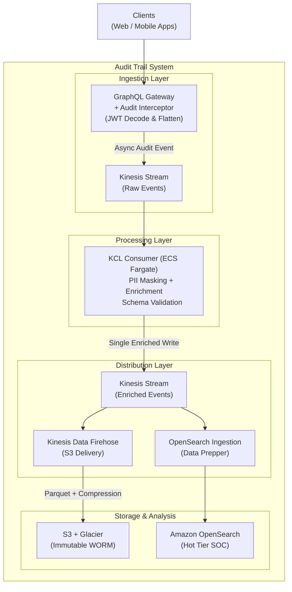

## Architecture Decision Record (ADR)

**Title**: Distributed Audit Trail & Forensic Logging Architecture

**Context:** Scalable Capital requires a centralized, immutable audit trail for ~100M daily requests (avg. 1,200 RPS) across a GraphQL Gateway and downstream services.

## Decision Summary

We will implement an **asynchronous, event-driven** pipeline using a Dual-Kinesis Fan-out architecture.

### 1. Ingestion

* **Service**: Amazon Kinesis Data Streams (Raw).
* **Strategy**: The GraphQL Gateway extracts and flattens JWT claims into the audit payload before ingestion

### 2. Compute (The Transformer)

* **Service**: KCL Application (ECS Fargate).
* **Strategy**: A dedicated service to handle PII masking, JWT claim extraction, and the write to the "Enriched" Kinesis stream. This optimizes cost and ensures a single point of forensic truth.

### 3. Distribution (The Fan-Out)

* **Service:** Kinesis Data Firehose & OpenSearch Ingestion (Data Prepper).
* **Strategy:** Infrastructure-level distribution to ensure data consistency across storage tiers without complex application-level error handling.

### 4. Storage (Hot & Cold Tiers)

* **Hot Tier (Real-time)**: Amazon OpenSearch Service
  - **Purpose**: Powering the SOC (Security Operations Center) dashboard and real-time alerting.
  - **Retention**: 30–90 days (managed by Index State Management/ISM).
  - **Value**: Near real-time searchability for incident response.
* **Cold Tier (Forensic):** Amazon S3 + Glacier
  - **Purpose**: Long-term, immutable legal and regulatory archival.
  - **Format**: **Apache Parquet** (via Firehose conversion) for cost-effective querying with Amazon Athena.
  - **Retention**: 7–10 years (managed by S3 Lifecycle Policies).
  - **Security**: S3 Object Lock (WORM) to prevent any tampering or deletion.

## Technical Justification & Evaluation of Rejected Paths

### 1. Ingestion: Why GraphQL Gateway does NOT process PII directly

**Decision:** The GraphQL Gateway extracts and flattens JWT claims into the audit payload before ingestion

**Rejected Path (Gateway-side processing):** Having the GraphQL Gateway perform PII masking and complex JWT claim extraction before sending.

**Rationale:**

* **User Latency:** Any millisecond spent on regex-masking or PII logic in the Gateway is a millisecond the user waits for their trade or portfolio data.
* **Separation of Concerns:** The Gateway should remain a "thin" entry point. Forensic logic should live in a dedicated security-hardened service.

**Implementation Detail:**

* The Gateway middleware intercepts the validated request context.
* It maps context.user.permissions and context.user.mfa\_status directly into the Kinesis PutRecord call.
* This ensures the audit trail contains the "effective permissions" at the exact moment the request was made, which is critical for forensic accuracy.

### 2. Compute: Why KCL on ECS vs. AWS Lambda?

**Decision**: KCL on ECS Fargate.

**Rejected Path (Lambda):** While easier to set up, at 100M requests/day (3 billion/month), Lambda is significantly more expensive due to execution overhead and the "Double-Hop" connection penalty to OpenSearch/Kinesis.

**Rationale:**

* **Cost:** ECS Fargate with reserved capacity is ~40-50% cheaper at this steady-state volume.
* **Performance:** KCL maintains persistent connection pools to Kinesis, avoiding the "Cold Start" and handshake overhead inherent in Lambda at scale.

**Cost Analysis: KCL on ECS vs. AWS Lambda**

|  |  |  |
| --- | --- | --- |
| **Cost Factor** | ~$31,000 - $43,000 | **KCL on ECS Fargate (Provisioned)** |
| **Request Fees** | ~$600/mo ($0.20 per 1M) | $0 (Included in compute) |
| **Compute / Duration** | ~$3,200 - $4,800/mo\* | ~$1,200 - $1,800/mo\*\* |
| **Total Est. Monthly** | ~$3,800 - $5,400 | ~$1,200 - $1,800 |
| **Annual Savings** |  | ~$31,000 - $43,000 |

*\*Assumes 512MB RAM, 200ms avg. execution, and optimized batching.  
\*\*Assumes a steady-state cluster of 4-6 vCPUs total to handle 1.2k RPS with head-room.*

### 3. Distribution - Why we use Fan-out instead of Direct KCL Writes

**Decision:** KCL writes to a second "Enriched" Kinesis Stream.

**Rejected Path**: Direct Multi-Sink Writes from KCL

**Rationale:**

* **Transactional Integrity**: Writing to two different destinations (S3 via SDK and OpenSearch via API) within the KCL application code creates a "Distributed Transaction" problem. If the KCL app crashes after writing to OpenSearch but before writing to S3, the audit trail becomes inconsistent.
* **Back-pressure Management:** Kinesis Data Firehose is specialized for S3. It handles batching, compression (Snappy/Gzip), and Parquet conversion natively. Forcing a KCL app to manage these S3-specific optimizations adds unnecessary complexity and memory pressure to the application code.
* **Independent Retries:** If the SOC's OpenSearch cluster is undergoing maintenance, Data Prepper/OSI will buffer and retry without affecting the S3 archival process.

### Security & Compliance

* **Immutability**: S3 Object Lock is enabled in "Compliance Mode" for the Cold Tier to ensure logs cannot be deleted even by root users for 7+ years.
* **PII Privacy:** The KCL app uses a "White-list" approach—any field not specifically allowed is masked/hashed by default.
* **Data Integrity:** Every record in the Enriched Stream is check summed, ensuring the SOC and the Forensics team are looking at the exact same data.

### Reliability vs. Latency

* This design prioritizes Gateway Latency (by using async Kinesis puts) and Storage Reliability (by using a fan-out to managed services). By decoupling the processing from the storage, we ensure that Scalable Capital's audit trail is both highly performant for users and absolutely durable for regulators.
* By flattening the data at the edge, we slightly increase the Gateway's work but significantly reduce the downstream complexity and data volume. This keeps the "Raw" stream lean and ensures the KCL app can process records faster, improving the end-to-end latency for the SOC team.

### Durability, Ordering & Backpressure

* **Durability**: Kinesis provides multi-AZ persistence
* **Backpressure Handling:**
  + Streams act as buffers during downstream slowdowns
  + Consumer lag monitored via CloudWatch
  + ECS auto-scaling adjusts processing capacity
* **Ordering Guarantees:**
  + Events are partitioned by userId
  + Ensures per-user ordering, sufficient for audit trails
* **Idempotency:**
  + Each event includes a unique deterministic ID
  + Downstream systems are designed to handle duplicate events

### SOC Integration

* Audit events are indexed in OpenSearch
* SOC teams define rules using:
  + OpenSearch Query DSL
  + Alerting framework

**Example Rule:**
Alert if: operation = withdrawFunds AND MFA\_VERIFIED claim is missing

This enables near real-time anomaly detection and response.

### Design Diagram

